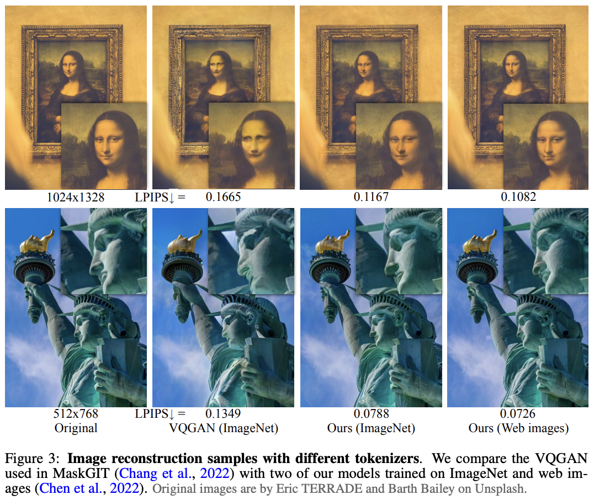

</img>

## MagViT2 - Pytorch

Implementation of MagViT2 from <a href="https://arxiv.org/abs/2310.05737">Language Model Beats Diffusion - Tokenizer is Key to Visual Generation</a> in Pytorch. This currently holds SOTA for video generation / understanding.

The Lookup Free Quantizer proposed in the paper can be found in a <a href="https://github.com/lucidrains/vector-quantize-pytorch/blob/master/vector_quantize_pytorch/lookup_free_quantization.py">separate repository</a>. It should probably be explored for all other modalities, starting with <a href="https://github.com/lucidrains/audiolm-pytorch/commit/c748fcdb565964bc562277bd73fbeb2e5df0ffca">audio</a>

Please join <a href="https://discord.gg/xBPBXfcFHd"></a> if you are interested in replicating the tokenizer proposed in this paper out in the open

## Appreciation

- <a href="https://stability.ai/">StabilityAI</a> and <a href="https://huggingface.co/">🤗 Huggingface</a> for the generous sponsorship, as well as my other sponsors, for affording me the independence to open source artificial intelligence.

- <a href="https://github.com/LouisSerrano">Louis Serrano</a> for sharing some early initial runs, validating that the overall architecture converges with finite scalar quantization.

- You? If you are a talented research engineer / scientist, feel free to contribute to cutting edge open source science!

## Install

```bash
$ pip install magvit2-pytorch
```

## Usage

```python
from magvit2_pytorch import (
    VideoTokenizer,
    VideoTokenizerTrainer
)

tokenizer = VideoTokenizer(
    image_size = 128,
    init_dim = 64,
    max_dim = 512,
    codebook_size = 1024,
    layers = (
        'residual',
        'compress_space',
        ('consecutive_residual', 2),
        'compress_space',
        ('consecutive_residual', 2),
        'linear_attend_space',
        'compress_space',
        ('consecutive_residual', 2),
        'attend_space',
        'compress_time',
        ('consecutive_residual', 2),
        'compress_time',
        ('consecutive_residual', 2),
        'attend_time',
    )
)

trainer = VideoTokenizerTrainer(
    tokenizer,
    dataset_folder = '/path/to/a/lot/of/media',     # folder of either videos or images, depending on setting below
    dataset_type = 'videos',                        # 'videos' or 'images', prior papers have shown pretraining on images to be effective for video synthesis
    batch_size = 4,
    grad_accum_every = 8,
    learning_rate = 2e-5,
    num_train_steps = 1_000_000
)

trainer.train()

# after a lot of training ...
# can use the EMA of the tokenizer

ema_tokenizer = trainer.ema_tokenizer

# mock video

video = torch.randn(1, 3, 17, 128, 128)

# tokenizing video to discrete codes

codes = ema_tokenizer.tokenize(video) # (1, 9, 16, 16) <- in this example, time downsampled by 4x and space downsampled by 8x. flatten token ids for (non)-autoregressive training

# sanity check

decoded_video = ema_tokenizer.decode_from_code_indices(codes)

assert torch.allclose(
    decoded_video,
    ema_tokenizer(video, return_recon = True)
)
```

To track your experiments on <a href="https://wandb.ai">Weights & Biases</a> set `use_wandb_tracking = True` on `VideoTokenizerTrainer`, and then use the `.trackers` context manager

```python

trainer = VideoTokenizerTrainer(
    use_wandb_tracking = True,
    ...
)

with trainer.trackers(project_name = 'magvit2', run_name = 'baseline'):
    trainer.train()

```

## Todo

- [ ] Magvit2 Tokenizer
    - [x] add adversarial loss
    - [x] implement the blurpool for antialiasing in discriminator
    - [x] LFQ should be able to pass loss breakdown (commitment and entropy), and forwarded to the return of the tokenizer
    - [x] add conditioning for encoder decoder with residual modulatable conv 3d
    - [x] `decode_from_codebook_indices` should be able to accept flattened ids and reshape to correct feature map dimensions and decode back to video
    - [x] add trainer and manage discriminator training
    - [x] add adaptive rmsnorm and conditionable transformer layers
    - [x] completely generalize to multiple discriminators at different time scales (taking inspiration of multi-resolution discriminators from soundstream)
        - [x] complete multiscale discriminator losses
        - [x] auto-manage multiscale discriminator optimizers
        - [ ] helper functions for crafting multi-resolution temporal discriminators (picking random consecutive frames)
    - [ ] add attention
        - [ ] use axial rotary embeddings for spatial
    - [ ] add an optional autoregressive loss at some penultimate layer of the decoder - check literature to see if anyone else has done this unification of transformer decoder + tokenizer in one architecture
- [ ] Improvise a <a href="https://arxiv.org/abs/2203.01941">RQ Video Transformer</a>, as residual LFQ actually makes sense now

- [ ] MaskGit

## Citations

```bibtex
@misc{yu2023language,
    title   = {Language Model Beats Diffusion -- Tokenizer is Key to Visual Generation}, 
    author  = {Lijun Yu and José Lezama and Nitesh B. Gundavarapu and Luca Versari and Kihyuk Sohn and David Minnen and Yong Cheng and Agrim Gupta and Xiuye Gu and Alexander G. Hauptmann and Boqing Gong and Ming-Hsuan Yang and Irfan Essa and David A. Ross and Lu Jiang},
    year    = {2023},
    eprint  = {2310.05737},
    archivePrefix = {arXiv},
    primaryClass = {cs.CV}
}
```

```bibtex
@inproceedings{dao2022flashattention,
    title   = {Flash{A}ttention: Fast and Memory-Efficient Exact Attention with {IO}-Awareness},
    author  = {Dao, Tri and Fu, Daniel Y. and Ermon, Stefano and Rudra, Atri and R{\'e}, Christopher},
    booktitle = {Advances in Neural Information Processing Systems},
    year    = {2022}
}
```

```bibtex
@article{Zhang2021TokenST,
    title   = {Token Shift Transformer for Video Classification},
    author  = {Hao Zhang and Y. Hao and Chong-Wah Ngo},
    journal = {Proceedings of the 29th ACM International Conference on Multimedia},
    year    = {2021}
}
```

```bibtex
@inproceedings{Arora2023ZoologyMA,
    title   = {Zoology: Measuring and Improving Recall in Efficient Language Models},
    author  = {Simran Arora and Sabri Eyuboglu and Aman Timalsina and Isys Johnson and Michael Poli and James Zou and Atri Rudra and Christopher R'e},
    year    = {2023},
    url     = {https://api.semanticscholar.org/CorpusID:266149332}
}
```
